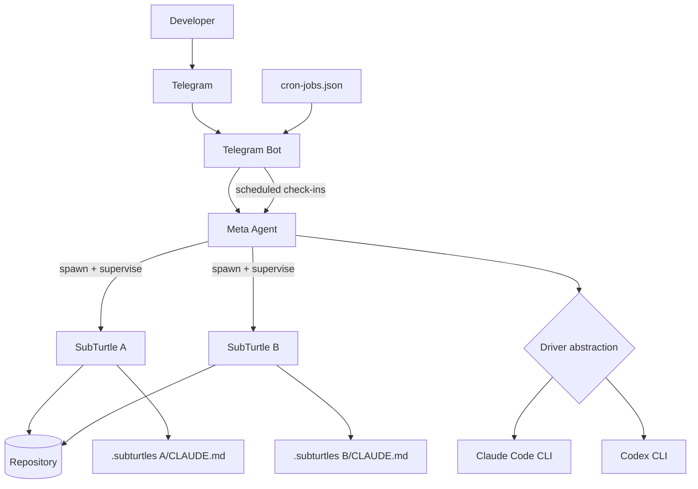

Super Turtle is a local multi-agent system orchestrated by one Meta Agent. The Meta Agent owns planning and supervision, delegates execution to SubTurtles, receives requests via Telegram, and exposes operational state in the local dashboard.

## Control-Plane Order

Use this mental model when reading the system docs:

1. **Meta Agent** decides strategy and delegation.
2. **SubTurtles** execute scoped work and emit durable lifecycle facts.
3. **Telegram Bot** is the operator interaction surface.
4. **Dashboard** is the local observability surface over runtime + conductor state.

## System Diagram



## Meta Agent

The Meta Agent is the orchestrator, not just a chat interface. It:

- Interprets requests from Telegram.
- Decomposes larger tasks into parallelizable units.
- Seeds SubTurtle state files and starts workers with `./super_turtle/subturtle/ctl spawn`.
- Monitors progress through scheduled supervision prompts.
- Sends milestone-only updates instead of noisy step-by-step logs.

The user experience stays simple: one conversation, multiple workers behind the scenes.

## SubTurtle Loop Types

Each SubTurtle runs one autonomous loop:

| Type | What it does | Typical use |
|------|---------------|-------------|
| `slow` | Plan -> Groom -> Execute -> Review | Complex multi-step work |
| `yolo` | Single Claude call per iteration | Default for most tasks |
| `yolo-codex` | Single Codex call per iteration | Cost-efficient worker mode |
| `yolo-codex-spark` | Single Codex Spark call per iteration | Fastest Codex-based loops |

See [SubTurtle Loop Types](/subturtles/loop-types) for details.

## State Management

Task intent is markdown-first and lives in `CLAUDE.md` files:

- Project-level state in the repo root.
- Per-worker state in `.subturtles/<name>/CLAUDE.md`.

Durable orchestration state is conductor-first and lives under `.superturtle/state/` (`workers`, `wakeups`, `inbox`, `events.jsonl`).

The backlog in each file is the execution contract for that run. A SubTurtle exits when it appends:

```md
## Loop Control
STOP
```

This keeps intent human-readable while lifecycle/delivery truth remains machine-checkable.

## Cron Supervision

`ctl spawn` automatically registers recurring supervision jobs in `super_turtle/claude-telegram-bot/cron-jobs.json`, but cron is now a trigger path, not the source of truth.

- Jobs are marked `silent: true` by default for low-noise operation.
- Check-ins run deterministic policy over canonical conductor state.
- Interval is configurable (`--cron-interval` on spawn, `ctl reschedule-cron` later).

The default spawn interval is 10 minutes, and it can be tightened or relaxed as workload changes.

## Driver Abstraction

Super Turtle routes execution through a driver layer so workers can use either runtime without changing task-level instructions:

- Claude Code: strongest reasoning and high-complexity workflows.
- Codex: lower-cost, faster loops for straightforward implementation.

`yolo` (Claude Code) is the default SubTurtle type. The Meta Agent can switch to `yolo-codex` based on task complexity and quota signals.

## What's Next

- Learn [SubTurtle commands](/subturtles/ctl-commands).
- Review [Meta supervision](/meta/supervision).
- Read [Drivers and models](/bot/drivers).
